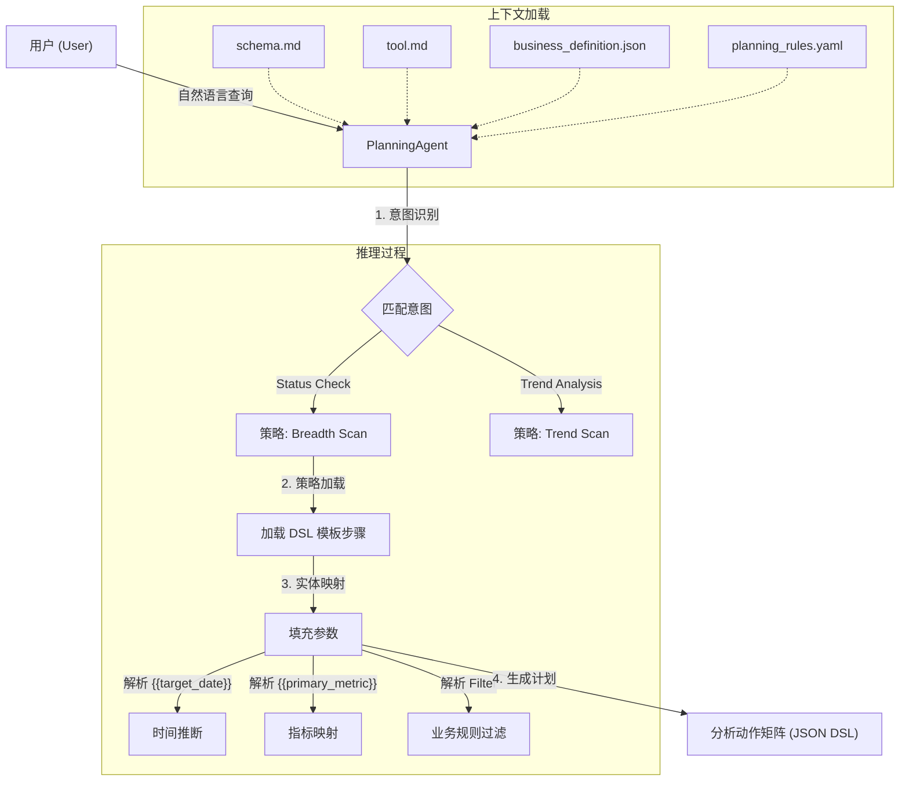
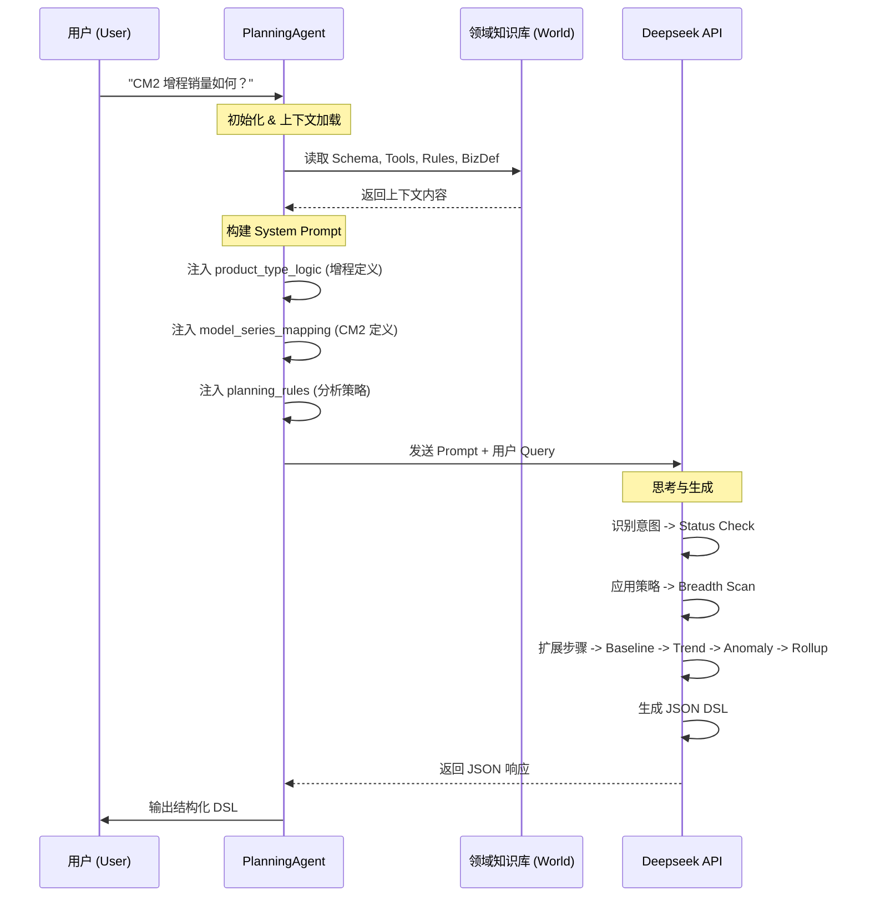
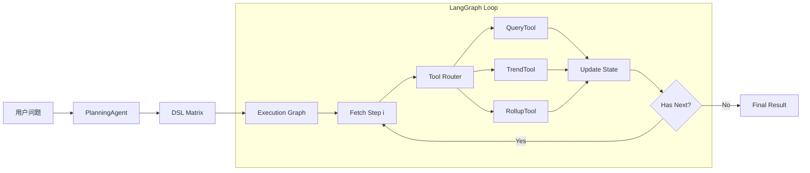

这是一个基于 LLM 的 **智能 BI 分析规划系统 (BI Planning Agent)**。该项目的核心目标是将用户的自然语言业务问题（如“昨日销量如何”）转化为结构化、可执行的分析动作序列（DSL），模拟高级数据分析师的思维路径。

以下是为您整理的项目经验文档总结。

---

# W52 Copilot 项目经验文档

## 1. 项目概述

本项目构建了一个 **配置驱动的智能规划 Agent** (`PlanningAgent`)。它不直接执行 SQL，而是充当“分析大脑”，负责理解业务意图并生成标准化的 **评估动作矩阵 (Evaluation Action Matrix)**。

核心设计理念是将 **业务逻辑（Rules/Definitions）** 与 **代码逻辑（Agent Code）** 分离，通过 YAML 和 JSON 配置文件来定义分析策略、指标口径和产品规则，使得系统具备极高的扩展性和维护性。

## 2. 项目结构说明

```text
W52_copilot/
├── agents/                      # 智能体核心逻辑层
│   ├── planning_agent.py        # [核心] 规划智能体主程序。负责加载上下文、调用 LLM、生成 DSL。
│   ├── planning_rules.yaml      # [核心] 规则引擎配置。定义了意图分类、分析策略模板 (如 breadth_scan)。
│   └── planning_agent改进建议.md  # 优化记录文档。
├── runtime/                     # [新增] 运行时环境
│   ├── context.py               # 数据上下文管理器 (DataManager) - 支持多时间轴 (Create/Lock/Delivery)
│   └── signals.py               # 信号与异常检测逻辑
├── world/                       # 领域知识层 (World Model)
│   ├── schema.md                # 数据模式定义。包含维度、指标、时间字段及计算口径。
│   ├── tool.md                  # 工具接口定义。描述 query, trend, rollup 等原子分析能力。
│   └── business_definition.json # 业务实体定义。包含车型映射、时间周期 (CM0/DM0)、产品分类逻辑。
└── .env                         # 环境配置 (API Key)。
```

## 3. 核心工作流 (Workflow)

该系统采用 **检索增强生成 (RAG)** + **策略模板填充** 的混合模式。Agent 在运行时动态加载所有领域知识，根据用户意图匹配预定义的分析策略。



## 4. 数据流 (Data Flow)

数据流描述了信息如何在系统各组件间流转，最终转化为可执行的指令。



## 5. 关键技术亮点

本项目在设计上体现了以下几个核心亮点，使其区别于普通的 Text-to-SQL 工具：

1.  **<u>配置驱动的策略引擎 (Configuration-Driven Strategy)</u>**

    - 将分析流程抽象为 `planning_rules.yaml` 中的模板。**修改 YAML 即可调整分析深度和步骤（如新增“异常检测”），无需修改一行 Python 代码**。这使得业务分析师可以直接维护分析逻辑。

2.  **<u>结构化 DSL 矩阵 (Structured DSL Matrix)</u>**

    - 输出不是不稳定的自然语言，也不是复杂的 SQL，而是 **标准化、人机可读的 JSON 动作序列**。每个步骤包含 `tool_name`, `parameters`, `reasoning` 和 `output_key`，完美支持 **<u>下游推理状态机 (Reasoning State Machine)</u>** 的缓存与回放。

3.  **<u>业务语义层注入 (Semantic Layer Injection)</u>**

    - 通过 `business_definition.json` 显式定义“黑话”和复杂逻辑（如“增程”=`Name LIKE %52%`，“CM2”=`特定日期范围`）。Agent 能够 **<u>零样本 (Zero-shot)</u>** 理解企业特有的业务术语，无需微调模型。

4.  **<u>确定性思维链 (Deterministic Chain-of-Thought)</u>**

    - 通过强制 LLM 遵循“基线 -> 趋势 -> 异常 -> 结构”的 **<u>广度扫描 (Breadth Scan)</u>** 策略，避免了模型“想到哪写到哪”的幻觉问题，确保了分析结果的 **完整性** 和 **专业性**。

5.  **<u>意图导向的动态规划 (Intent-Based Dynamic Planning)</u>**
    - 系统首先对用户问题进行 **意图分类**（如状态评估 vs 归因分析），然后动态挂载不同的分析策略。这使得同一个 Agent 可以灵活应对 **“是多少” (Fact Lookup)** 和 **“为什么” (Attribution)** 等不同深度的查询。

## 6. 执行引擎架构 (Execution Engine)

在生成 DSL 之后，系统引入了 **LangGraph** 作为核心执行引擎，构建了一个模块化、可观测的 **Tool Execution Pipeline**。

### 架构设计

```text
pipelines/bi_copilot.py  -->  Application Entry (DSL -> Graph -> Result)
agents/execution_graph.py -->  StateGraph Definition (Loop: Step -> Router -> Tool)
tools/router.py          -->  Tool Dispatcher
tools/*.py               -->  Atomic Tool Implementations
```

### 核心组件

1.  **Execution State (`execution_state.py`)**: 维护执行过程中的上下文状态，包括：

    - `dsl_sequence`: 待执行的动作序列。
    - `current_step`: 当前执行指针。
    - `results`: 存储每一步工具的执行结果（支持后续步骤引用）。
    - `signals`: 运行时产生的信号（如异常检测触发的 drill-down 信号）。

2.  **Tool Router (`router.py`)**: 负责将抽象的 DSL Step 分发给具体的 Tool 实现类。

    - 支持扩展新的工具只需注册到 Router，无需修改 Graph 逻辑。

3.  **LangGraph Workflow**:
    - 采用循环图结构：`execute_step` -> `should_continue` -> `execute_step` / `END`。
    - 这种设计未来可轻松扩展为支持 **ReAct** 模式（即允许 Agent 在执行过程中根据结果动态修改后续计划）。

### 完整数据流 (End-to-End Flow)



---

## 7. 📅 今日成果总结 (2026-01-04) 运行时与数据接入 (Runtime & Data Access)

为了支持真实的业务数据分析，系统实现了稳健的运行时环境：

1.  **单例数据管理器 (Singleton DataManager)**

    - 位于 `runtime/context.py`，确保大规模 Parquet 数据 (`order_full_data.parquet`) 仅加载一次。
    - **T+1 时间逻辑**: 自动基于系统时间推断 "Yesterday"，并结合数据最大日期进行边界校验。
    - **动态业务逻辑注入**: 在加载时实时计算 `series_group` 等衍生维度。

2.  **增强型趋势分析 (Enhanced Trend Analysis)**

    - `TrendTool` 实现了智能回溯查询。针对单点时间（如“昨日”）的查询，自动检索 T-1 和 T-7 数据以计算日环比 (DoD) 和周同比 (WoW)，解决了单点数据无法计算变化率的问题。

3.  **统计异常检测 (Statistical Anomaly Detection)**
    - 基于历史滑动窗口（如最近 30 天）计算均值与标准差。
    - 使用 Z-Score 和变异系数 (CV) 判定数据波动是否属于正常范围，自动生成 `anomaly_decision` 信号。

---

这份文档总结了当前 W52 Copilot 的技术架构与核心价值，可作为后续开发迭代的基石。

---

## 8. 案例分析：昨日锁单量分析流 (Case Study: Yesterday Lock Analysis)

本案例展示了系统如何处理“昨日销量如何”这一典型业务问题。
脚本路径: `pipelines/yesterday_lock.py`

### 分析逻辑流 (Reasoning Flow)

该流程体现了 **Breadth Scan (广度扫描)** 策略：先看总数，再看趋势，最后看结构。


### 关键步骤解析

1.  **Baseline Query**: 获取昨日绝对值（锁单量）。
2.  **Trend Analysis**:
    - **MoM**: 环比变化，判断短期动能。
    - **WoW**: 同比变化，排除周度周期性影响。
    - **Anomaly**: 基于 30 天历史计算 Z-Score，自动标记异常。
3.  **Structure Analysis**:
    - 按 `series_group`（车系）拆解，识别主力车型。
    - **Pareto**: 识别核心贡献源（二八定律）。
