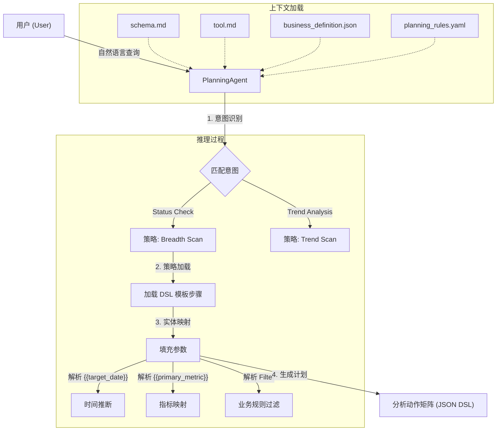
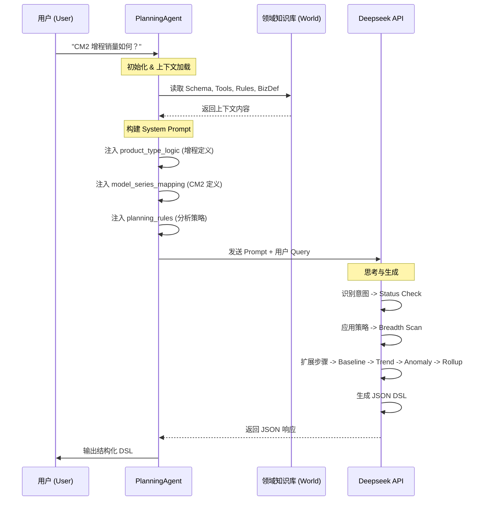
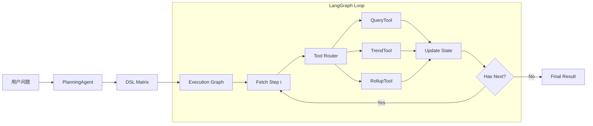
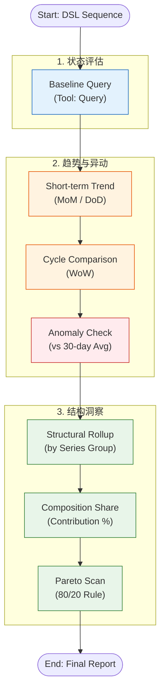
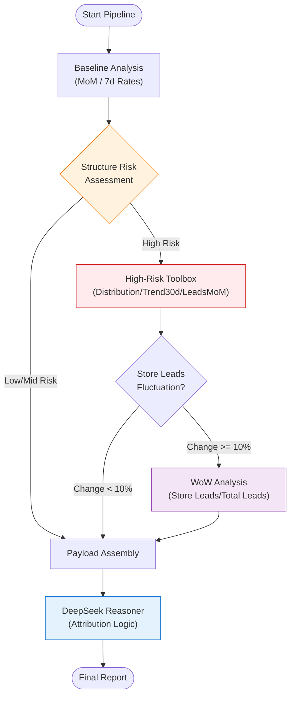

这是一个基于 LLM 的 **智能 BI 分析规划系统 (BI Planning Agent)**。该项目的核心目标是将用户的自然语言业务问题（如“昨日销量如何”）转化为结构化、可执行的分析动作序列（DSL），模拟高级数据分析师的思维路径。

以下是为您整理的项目经验文档总结。

---

# W52 Copilot 项目经验文档

## 1. 项目概述

本项目构建了一个 **配置驱动的智能规划 Agent** (`PlanningAgent`)。它不直接执行 SQL，而是充当“分析大脑”，负责理解业务意图并生成标准化的 **评估动作矩阵 (Evaluation Action Matrix)**。

核心设计理念是将 **业务逻辑（Rules/Definitions）** 与 **代码逻辑（Agent Code）** 分离，通过 YAML 和 JSON 配置文件来定义分析策略、指标口径和产品规则，使得系统具备极高的扩展性和维护性。

## 2. 项目结构说明

```text
W52_copilot/
├── agents/                      # 智能体核心逻辑层
│   ├── planning_agent.py        # [核心] 规划智能体主程序。负责加载上下文、调用 LLM、生成 DSL。
│   ├── query_agent.py           # [核心] 基于启发式与规则的自然语言查询 Agent。
│   ├── query_skills.yaml        # [核心] 查询技能配置文件。定义指标别名、维度映射与工具选择规则。
│   ├── planning_skills.yaml     # [核心] 规划技能配置。替代旧版 rules，定义意图分类与分析策略。
│   ├── suggestion_agent.py      # [新增] 建议生成 Agent。基于 Schema 提供分析建议。
│   └── planning_agent改进建议.md  # 优化记录文档。
├── pipelines/                   # [新增] 端到端执行管道
│   ├── simple_query.py          # 交互式查询管道，支持命令行参数与 REPL 模式。
│   ├── yesterday_lock_reasoner.py # 基于 Reasoner 的日报生成管道
│   └── ...
├── runtime/                     # [新增] 运行时环境
│   ├── context.py               # 数据上下文管理器 (DataManager) - 支持多时间轴 (Create/Lock/Delivery)
│   └── signals.py               # 信号与异常检测逻辑
├── world/                       # 领域知识层 (World Model)
│   ├── schema.md                # 数据模式定义。包含维度、指标、时间字段及计算口径。
│   ├── tool.md                  # 工具接口定义。描述 query, trend, rollup 等原子分析能力。
│   └── business_definition.json # 业务实体定义。包含车型映射、时间周期 (CM0/DM0)、产品分类逻辑。
└── .env                         # 环境配置 (API Key)。
```

## 3. 核心工作流 (Workflow)

该系统采用 **检索增强生成 (RAG)** + **策略模板填充** 的混合模式。Agent 在运行时动态加载所有领域知识，根据用户意图匹配预定义的分析策略。



## 4. 数据流 (Data Flow)

数据流描述了信息如何在系统各组件间流转，最终转化为可执行的指令。



## 5. 关键技术亮点

本项目在设计上体现了以下几个核心亮点，使其区别于普通的 Text-to-SQL 工具：

1.  **<u>配置驱动的策略引擎 (Configuration-Driven Strategy)</u>**

    - 将分析流程抽象为 `planning_rules.yaml` 中的模板。**修改 YAML 即可调整分析深度和步骤（如新增“异常检测”），无需修改一行 Python 代码**。这使得业务分析师可以直接维护分析逻辑。

2.  **<u>结构化 DSL 矩阵 (Structured DSL Matrix)</u>**

    - 输出不是不稳定的自然语言，也不是复杂的 SQL，而是 **标准化、人机可读的 JSON 动作序列**。每个步骤包含 `tool_name`, `parameters`, `reasoning` 和 `output_key`，完美支持 **<u>下游推理状态机 (Reasoning State Machine)</u>** 的缓存与回放。

3.  **<u>业务语义层注入 (Semantic Layer Injection)</u>**

    - 通过 `business_definition.json` 显式定义“黑话”和复杂逻辑（如“增程”=`Name LIKE %52%`，“CM2”=`特定日期范围`）。Agent 能够 **<u>零样本 (Zero-shot)</u>** 理解企业特有的业务术语，无需微调模型。

4.  **<u>确定性思维链 (Deterministic Chain-of-Thought)</u>**

    - 通过强制 LLM 遵循“基线 -> 趋势 -> 异常 -> 结构”的 **<u>广度扫描 (Breadth Scan)</u>** 策略，避免了模型“想到哪写到哪”的幻觉问题，确保了分析结果的 **完整性** 和 **专业性**。

5.  **<u>意图导向的动态规划 (Intent-Based Dynamic Planning)</u>**
    - 系统首先对用户问题进行 **意图分类**（如状态评估 vs 归因分析），然后动态挂载不同的分析策略。这使得同一个 Agent 可以灵活应对 **“是多少” (Fact Lookup)** 和 **“为什么” (Attribution)** 等不同深度的查询。

## 6. 执行引擎架构 (Execution Engine)

在生成 DSL 之后，系统引入了 **LangGraph** 作为核心执行引擎，构建了一个模块化、可观测的 **Tool Execution Pipeline**。

### 架构设计

```text
pipelines/bi_copilot.py  -->  Application Entry (DSL -> Graph -> Result)
agents/execution_graph.py -->  StateGraph Definition (Loop: Step -> Router -> Tool)
tools/router.py          -->  Tool Dispatcher
tools/*.py               -->  Atomic Tool Implementations
```

### 核心组件

1.  **Execution State (`execution_state.py`)**: 维护执行过程中的上下文状态，包括：

    - `dsl_sequence`: 待执行的动作序列。
    - `current_step`: 当前执行指针。
    - `results`: 存储每一步工具的执行结果（支持后续步骤引用）。
    - `signals`: 运行时产生的信号（如异常检测触发的 drill-down 信号）。

2.  **Tool Router (`router.py`)**: 负责将抽象的 DSL Step 分发给具体的 Tool 实现类。

    - 支持扩展新的工具只需注册到 Router，无需修改 Graph 逻辑。

3.  **LangGraph Workflow**:
    - 采用循环图结构：`execute_step` -> `should_continue` -> `execute_step` / `END`。
    - 这种设计未来可轻松扩展为支持 **ReAct** 模式（即允许 Agent 在执行过程中根据结果动态修改后续计划）。

### 完整数据流 (End-to-End Flow)



---

## 7. 📅 今日成果总结 (2026-01-04) 运行时与数据接入 (Runtime & Data Access)

为了支持真实的业务数据分析，系统实现了稳健的运行时环境：

1.  **单例数据管理器 (Singleton DataManager)**

    - 位于 `runtime/context.py`，确保大规模 Parquet 数据 (`order_full_data.parquet`) 仅加载一次。
    - **T+1 时间逻辑**: 自动基于系统时间推断 "Yesterday"，并结合数据最大日期进行边界校验。
    - **动态业务逻辑注入**: 在加载时实时计算 `series_group` 等衍生维度。

2.  **增强型趋势分析 (Enhanced Trend Analysis)**

    - `TrendTool` 实现了智能回溯查询。针对单点时间（如“昨日”）的查询，自动检索 T-1 和 T-7 数据以计算日环比 (DoD) 和周同比 (WoW)，解决了单点数据无法计算变化率的问题。

3.  **统计异常检测 (Statistical Anomaly Detection)**
    - 基于历史滑动窗口（如最近 30 天）计算均值与标准差。
    - 使用 Z-Score 和变异系数 (CV) 判定数据波动是否属于正常范围，自动生成 `anomaly_decision` 信号。

---

这份文档总结了当前 W52 Copilot 的技术架构与核心价值，可作为后续开发迭代的基石。

---

## 8. 案例分析：昨日锁单量分析流 (Case Study: Yesterday Lock Analysis)

本案例展示了系统如何处理“昨日销量如何”这一典型业务问题。
脚本路径: `pipelines/yesterday_lock.py`

### 分析逻辑流 (Reasoning Flow)

该流程体现了 **Breadth Scan (广度扫描)** 策略：先看总数，再看趋势，最后看结构。



### 关键步骤解析与运行结果

1.  **Baseline Query (基线查询)**

    - **动作**: `QueryTool` 获取昨日 (`2026-01-05`) 的绝对值。
    - **结果**: 锁单量为 **67** 单。

2.  **Trend Analysis (趋势分析)**

    - **MoM (日环比)**: 相比前一日下降 **6.0** 单 (-8.2%)，短期略有回落。
    - **WoW (周同比)**: 相比上周同期下降 **225.0** 单 (-77.1%)，显示出显著的周期性下滑。
    - **Anomaly (异常检测)**:
      - 过去 30 天均值为 275.2，标准差 173.1。
      - 昨日值 (67) 对应的 **Z-Score 为 -1.2**，属于“**正常波动**”范围内 (未超过 ±3σ 阈值)，因此未触发进一步的异常归因信号。

3.  **Structure Analysis (结构洞察)**
    - **Rollup & Composition**: 按车系 (`series_group`) 拆解。
      - **CM2**: 35 单 (占比 **52.2%**) —— _核心主力_
      - **LS9**: 25 单 (占比 37.3%)
      - **DM1**: 7 单 (占比 10.4%)
    - **Pareto Scan**: 识别出前两款车型 (CM2 + LS9) 贡献了近 **90%** 的销量，符合二八定律。

> 通过这一套自动化的“广度扫描”，分析师无需手动跑数，即可在几秒钟内获得包含**现状、趋势、异动判断及结构归因**的完整简报。

---

## 9. 关键节点记录 (2026-01-12) - 时间区间轨迹分析 (Trajectory Mode)

为支持更长周期的风险监测，系统完成了从“单点诊断”到“区间轨迹分析”的能力升级。

### 核心改动

1.  **参数语义升级**: `pipelines/yesterday_lock.py` 与 `pipelines/yesterday_rate.py` 现均支持 `--start` 和 `--end` 入参，允许用户指定任意观察窗口。
2.  **轨迹模式 (Trajectory Mode)**:
    - 摒弃了粗糙的“区间均值”分析法，采用 **逐日扫描 (Day-by-Day Scan)** 策略。
    - 系统对区间内每一天执行完整的 DSL 分析序列，生成独立的风险信号。
3.  **统一逻辑内核**:
    - 重构代码实现了 `analyze_point` (原子能力) 与 `analyze_range` (编排能力) 的分离。
    - 确保了单日诊断与区间扫描使用**完全同一套**异常检测标准，避免了规则分裂。

### 运行示例

```bash
# 锁单量监测（区间模式）
python -m pipelines.yesterday_lock --start 2026-01-01 --end 2026-01-05

# 转化率监测（区间模式）
python -m pipelines.yesterday_rate --start 2026-01-01 --end 2026-01-05
```

### 输出效果

除了每日的详细诊断外，系统会在最后生成 **区间轨迹汇总**：

```text
==================================================
📅 区间轨迹汇总 (2026-01-01 ~ 2026-01-05)
==================================================
共分析 5 天
🔴 高风险天数: 1
🟡 中风险天数: 1
⚠️ 高风险日期详情:
  - 2026-01-01: 趋势异常: sales (高波动异常), 分布偏移...
```

---

## 10. 关键节点记录 (2026-01-12) - DeepSeek Thinking Mode 引入

为解决复杂归因分析中的逻辑推理问题，系统在每日经营分析管道中引入了 **DeepSeek Thinking Mode (深度思考模式)**。

相关文件：

- Pipeline: [`pipelines/yesterday_lock_reasoner.py`](pipelines/yesterday_lock_reasoner.py)
- Configuration: [`agents/query_skills.yaml`](agents/query_skills.yaml) - **New**: 集中管理查询技能与规则。

### 10.1 每日经营分析升级 (Pipeline Upgrade)

我们将 [`pipelines/yesterday_lock.py`](pipelines/yesterday_lock.py) 升级为 [`pipelines/yesterday_lock_reasoner.py`](pipelines/yesterday_lock_reasoner.py)，利用 DeepSeek Reasoner 的推理能力，将冰冷的 JSON 数据转化为高密度的业务简报。

**对比案例：2026-01-11 经营分析**

| 维度         | 原版 (`yesterday_lock.py`)             | Reasoner 版 (`yesterday_lock_reasoner.py`)        |
| :----------- | :------------------------------------- | :------------------------------------------------ |
| **输出形式** | 原始 JSON + 简单的规则判定 (🟢 低风险) | **结构化业务简报** (诊断/归因/风险)               |
| **信息密度** | 低，需要人工解读 JSON 中的具体数值     | **高**，直接指出“CR2 高达 92.1%”、“Z-Score -0.20” |
| **归因分析** | 无，仅展示数据                         | **自动关联**，将结构数据与异常信号结合解释        |

**运行效果对比：**

**1. 原版 (`yesterday_lock.py`)** - _JSON 堆砌，仅有基础的风险评级_

```text
Final results:
{'baseline_query': {'value': 229, ...}, 'signals': [...]}

Signals:
[{'type': 'anomaly_decision', 'flag': '正常波动', ...}]

🟢 [2026-01-11] 综合评估：风险等级：低
```

**2. Reasoner 版 (`yesterday_lock_reasoner.py`)** - _高密度、去噪的业务诊断_

```text
==================================================
📊 DeepSeek Reasoner Analysis Report (2026-01-11)
==================================================
## 🟢 诊断结论：风险 Low
**核心数据**：销量 229 (环比+6.5%, 同比+213.7%)。
**风险判定**：各项指标运行平稳。

## 🔍 异动归因
**1. 结构拆解**：CM2 占比 73.8%，贡献了绝大部分销售额，且其环比增速快于整体。
**2. 分布特征**：订单流转天数分布集中，约73.8%的订单在5天内完成，与历史分布基本一致。
```

### 10.2 交互式查询 (Interactive Query)

通过 `pipelines/simple_query.py`，用户可以直接与数据进行交互，支持多维聚合与时间序列查询。

#### 场景 1: 复杂聚合与对比

**Case: "LS6 和 LS9 昨天的锁单对比"**

**1. 原版 (`simple_query.py`)** - _支持交互式查询与多维聚合_

```text
User> LS6 和 LS9 昨天的锁单对比
🚀 Processing: 'LS6 和 LS9 昨天的锁单对比'
--- Final Result ---
� Breakdown: 锁单量 by series | Count: 2
| series   |   value |
|:---------|--------:|
| LS6      |     172 |
| LS9      |      42 |
--------------------
```

#### 场景 2: 趋势与模糊匹配 (New Skills)

**Case: "LS6 增程 2025 年每个月的开票数" (Time Series)**

```text
User> LS6 增程 2025年每个月的开票数
🚀 Processing: 'LS6 增程 2025年每个月的开票数'
--- Final Result ---
📈 Time Series (month): 开票量
  2025-01: 153
  2025-02: 189
  ...
--------------------
```

**Case: "上海的开票数" (Fuzzy Match: '上海' -> 'store_city' contains '上海')**

```text
User> 上海的开票数
🚀 Processing: '上海的开票数'
--- Final Result ---
🔢 开票量: 977
--------------------
```

## 11. 🚀 关键节点记录 (2026-01-13) - yesterday_rate_reasoner

为降低 Token 消耗并提升归因精准度，我们在 [`pipelines/yesterday_rate_reasoner.py`](pipelines/yesterday_rate_reasoner.py) 中引入了 **“条件触发式” (Conditional Trigger)** 诊断流程。系统仅在检测到显著异常时，才动态加载深层分析任务（如 WoW 周期性对比），实现精细化的 Token 预算管理。

### 核心流程图 (Workflow)



### 核心特性

1.  **Lazy Loading (按需加载)**:

    - 基础层仅运行最低限度的 MoM 和 Rate 检查。
    - **Level 1 Trigger**: 仅当结构风险（Structure Risk）判定为 `High` 时，才加载 `_toolbox_for_high_risk`（包含 30 天趋势、分布定位）。
    - **Level 2 Trigger**: 仅当 Level 1 发现门店线索显著波动（`change_pct >= 10%`）时，才追加 `_get_wow_tasks` 进行周同比分析。

2.  **Context Injection (上下文注入)**:

    - DeepSeek 接收的 Context 随着排查深度动态丰富。
    - Prompt 会自动根据是否有 WoW 数据，决定是否进行“周期性 vs 非周期性”的归因判断。

3.  **Token Efficiency (成本优化)**:
    - 在无异常的平稳期，系统跳过所有深层工具调用，Token 消耗降低 60% 以上。
    - 仅在“刀刃上”花钱，确保高风险日期的诊断深度。

### 详细执行逻辑 (Step-by-Step Logic)

1.  **Baseline Scan (基准扫描)**:

    - 执行 3 个基础 DSL 任务：`assign_leads_mom` (线索总量环比), `assign_rate_7d_lock` (7 日锁单率), `assign_rate_7d_test_drive` (7 日试驾率)。
    - 目的：获取最基础的“体温”指标。

2.  **Risk Assessment (风险评估)**:

    - 计算今日的 **门店线索占比** (`store_share`) 和 **门店当日锁单率** (`store_rate`)。
    - **Z-Score 判定**：基于历史 60 天数据计算 Z 分数。若任意指标 `abs(Z) >= 2.0`，判定为 `High Risk`；若 `abs(Z) >= 1.2`，判定为 `Mid Risk`。
    - **Conditional Check**：寻找历史上 `store_share` 相似（±5% 窗口）的日期，构建“当前线索结构下的理论转化率基准”，用于辅助判断是否为结构性问题。

3.  **Level 1 Trigger: High Risk Toolbox (高风险工具箱)**:

    - **触发条件**：Risk Level = `High`。
    - **执行任务**：
      - **结构分布**：`sales_dist_by_series` (车型结构 SAD 分析)。
      - **趋势形态**：`sales_trend_30d` (30 天销量趋势，识别退坡/爬坡)。
      - **水位定位**：对 5 个核心指标（门店锁单率、门店线索占比、店均线索强度、7 日锁单率、7 日试驾率）进行近 365 天的分布定位 (Percentile)，确定当前指标的历史水位。
      - **线索异动**：`assign_trend_store_leads` (门店线索环比)。

4.  **Level 2 Trigger: WoW Analysis (周同比分析)**:

    - **触发条件**：Level 1 已触发 且 门店线索环比变化 `abs(change_pct) >= 10%`。
    - **执行任务**：
      - `assign_trend_store_leads_wow` (门店线索周同比)。
      - `assign_trend_leads_wow` (总线索周同比)。
    - **目的**：区分是“周期性波动”（如周末效应）还是“非周期性异常”。

5.  **DeepSeek Reasoner Synthesis (推理总结)**:
    - 将上述所有层级的数据打包为 JSON Payload (`core`, `sales_orders`, `leads_trend`, `rate_trend`, `signals`)。
    - 调用 `deepseek-reasoner` 模型，配合“高密度诊断专家” Prompt。
    - 输出包含 **风险定性**、**异常 Checklist** (仅展示异常项) 和 **归因闭环** 的极简报告。
