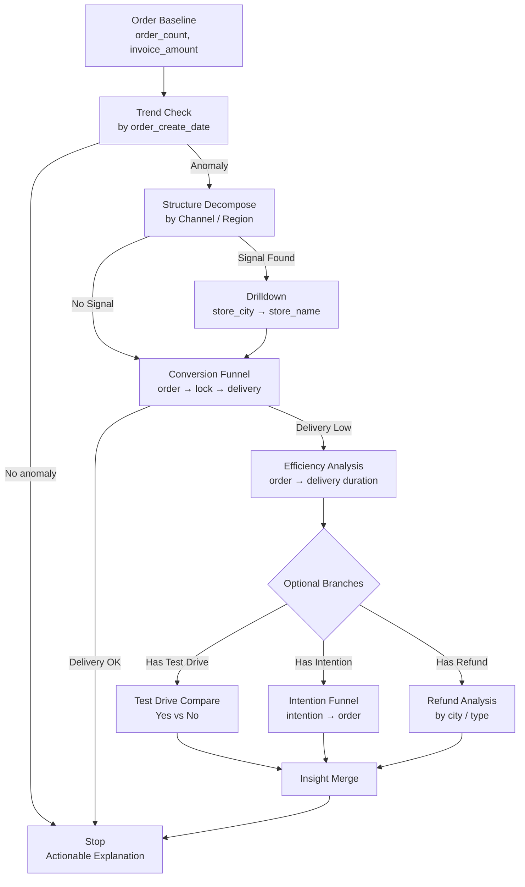

非常好，这一步**已经从“思想”进入“系统工程”了**。
我会严格按你刚才那一版 **BI reasoning DSL** 来做两件事：

1. **抽象为可执行 / 可配置的 `AnalysisStrategy YAML`**（偏 Copilot / Agent 用）
2. **用 Mermaid 画一张“可推理的数据流图”**（不是血缘图，而是 _reasoning flow_）

我会刻意保持三点一致性：

- 和你现在的 LangGraph / AnalysisStrategy 思路兼容
- 把「默认路线」和「条件分支」显性化
- 明确 _additive / ratio / duration_ 的分析语义

---

## 一、AnalysisStrategy YAML（订单节点 · 默认策略）

> 你可以把它理解为：
> **Order 节点被触发时，系统“第一反应应该怎么分析”**

```yaml
analysis_strategy:
  name: order_default_reasoning
  entity: order
  description: >
    Default BI reasoning strategy for Order lifecycle analysis.
    Start from order facts, then decompose structure, conversion, and efficiency.

  entrypoint:
    metric:
      - order_count
      - invoice_amount
    time_field: order_create_date

  steps:
    - id: trend_check
      type: trend
      priority: 1
      params:
        metric: order_count
        time_field: order_create_date
      goal: detect_overall_change

    - id: structure_decompose
      type: additive_decompose
      priority: 2
      condition: trend_check.anomaly_detected == true
      params:
        metric: order_count
        dimensions:
          - first_middle_channel_name
          - parent_region_name
      goal: locate_contribution_source

    - id: store_drilldown
      type: drilldown
      priority: 3
      condition: structure_decompose.signal_detected == true
      params:
        path:
          - store_city
          - store_name
      goal: pinpoint_execution_unit

    - id: conversion_funnel
      type: ratio_funnel
      priority: 4
      params:
        stages:
          - order_create_time
          - lock_time
          - delivery_date
      output:
        - lock_rate
        - delivery_rate
      goal: evaluate_process_health

    - id: efficiency_analysis
      type: duration
      priority: 5
      condition: conversion_funnel.delivery_rate < threshold
      params:
        duration_pairs:
          - from: order_create_time
            to: delivery_date
        group_by:
          - store_city
      goal: identify_delay_bottleneck

    - id: test_drive_branch
      type: conditional_compare
      priority: 6
      activation_rule:
        field: first_test_drive_time
        mode: optional
      params:
        compare_groups:
          - condition: first_test_drive_time IS NOT NULL
          - condition: first_test_drive_time IS NULL
        metrics:
          - order_count
          - delivery_rate
      goal: assess_test_drive_impact

    - id: intention_branch
      type: ratio_funnel
      priority: 7
      activation_rule:
        field: intention_payment_time
        mode: optional
      params:
        stages:
          - intention_payment_time
          - order_create_time
      goal: analyze_hesitation_loss

    - id: refund_branch
      type: exception_analysis
      priority: 8
      activation_rule:
        field: apply_refund_time
        mode: optional
      params:
        metric: refund_rate
        dimensions:
          - store_city
          - order_type
      goal: detect_reverse_flow_risk

  termination_rules:
    - condition: drilldown_level == store_name
      action: stop
    - condition: insight_gain < minimum_threshold
      action: stop
    - condition: explanation_confirmed == true
      action: stop
```

### 🔑 这个 YAML 有 4 个关键设计点

1. **entrypoint = 分析锚点**
   → 明确告诉系统：订单分析，永远从 _order_create_date_ 出发

2. **priority ≠ 顺序，而是“默认权重”**
   → 允许你未来在 Agent 中并行 / 跳步

3. **activation_rule 明确“空值 ≠ 脏数据”**
   → 空值 = _optional path_，不是异常

4. **termination_rules 是 Copilot 的“刹车系统”**
   → 防止无限 drill（你之前非常在意这一点）

---

## 二、Mermaid：订单 BI Reasoning 数据流图

> 这不是 ETL 图，也不是表血缘
> 而是：**“当我问一个订单问题，系统是怎么走的”**



### 🧠 这张图的“隐藏信息”

- **主干始终只有一条**（Baseline → Trend → Structure → Funnel）
- 所有业务复杂度都被**压到 Optional Branch**
- _Stop_ 是一等公民（不是失败，是完成）

---

## 三、和你现有系统的直接映射关系

| 概念                  | 你系统里的位置                                 |
| --------------------- | ---------------------------------------------- |
| AnalysisStrategy YAML | CopilotPlan / AnalysisStrategy                 |
| step.type             | reasoning operator（trend / additive / ratio） |
| activation_rule       | LangGraph 条件边                               |
| termination_rules     | Copilot 停止条件                               |
| Mermaid flow          | LangGraph DAG 的“人类可读版”                   |

---

## 四、下一步（已经是 PR 级别了）

如果你愿意继续，我可以直接帮你做其中一个：

1. **把这个 YAML 拆成 LangGraph Node 定义（Python 级）**
2. **抽象一套通用 reasoning operator schema（Order / Lead / TestDrive 可复用）**
3. **把“空值 = 路径未发生”正式写成系统级规则（非常关键）**

你直接选一个，我继续往下推。
